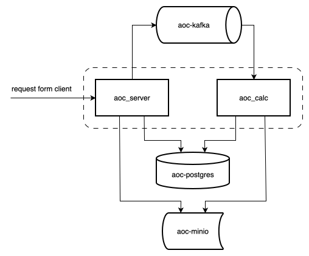

# Advent of Code

[adventofcode.com](https://adventofcode.com)

## REST-service for puzzles solving

Version 1.0.0

Requirements:

- ***Go 1.26*** or higher
- ***Podman Desktop*** (or Docker Desktop)
- [***Goose***](https://github.com/pressly/goose)
- [***Task***](https://taskfile.dev/docs/installation)
- [***golangci-lint***](https://golangci-lint.run/docs/welcome/install/local/) v2
- [***oapi-codegen***](https://github.com/oapi-codegen/oapi-codegen) v2

### Supported puzzles

| Year of the event | Days with part 1 | Days with part 2 |
|:------------------|:-----------------|:-----------------|
| 2024              | 1                | 1                |
| 2025              | 1-6              | 1-6              |

### API description

OpenAPI description of supported methods is located in [openapi-go-away-2024.yml](api/openapi-go-away-2024.yml).

You can generate actual API interface:

```shell
go generate ./...
```

### Build

Tasks are described in [Taskfile.yml](Taskfile.yml) and run from the project root:

```shell
task              # generate, lint, test and build
task generate     # regenerate API code
task lint         # golangci-lint run
task test         # all tests (database tests need local environment and migrations)
task test:unit    # puzzle tests only, no local environment needed
```

### Launch application

Run local environment:

```shell
cd local-env
podman compose up -d
cd ..
```

Apply all available migrations:

```shell
cd db-migrations
goose up
cd ..
```

Start application:

```shell
cd cmd
go run main.go
```

### Application diagram


